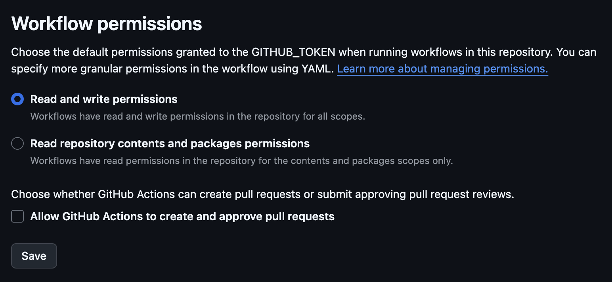

# distribute-to-appstore Workflow

This workflow will setup codemagic-cli-tools from npm and distribute an artifact to AppStore Connect.

A tag will be created - `v1.0.0+123-ios` for runs on the `production-branch-name`.

## Inputs

#### Required

- `artifact-name`: The name of the artifact to upload
- `project-name`: The name of the project to build

#### Optional

- `project-directory:` The directory of the project to build (e.g. MyApp/)
- `production-branch-name`: The branch name to use for production environment
- `create-tags`: Create tags for the release

## Repository Secrets

#### Required

- `APP_STORE_CONNECT_ISSUER_ID`: The app store connect issuer id
- `APP_STORE_CONNECT_KEY_IDENTIFIER`: The app store connect key identifier
- `APP_STORE_CONNECT_PRIVATE_KEY`: The app store connect private key
- `IOS_SIGNING_CERTIFICATE_BASE64`: The base64 encoded iOS signing certificate
- `IOS_SIGNING_CERTIFICATE_PASSWORD`: The iOS signing certificate password
- `IOS_PROVISIONING_PROFILE_BASE64`: The base64 encoded iOS provisioning profile
- `IOS_KEYCHAIN_PASSWORD`: The iOS keychain password
- `APP_STORE_APP_ID`: The iOS app store app id

Follow [this guide](https://blog.codemagic.io/deploy-your-app-to-app-store-with-codemagic-cli-tools-and-github-actions/#using-existing-certificates-and-profiles) to learn more about codemagic-cli-tools and the AppStore Connect configuration

## Repository Settings

In order to use the tag feature for production releases you must allow this workflow write access to the calling repository.



## Usage

```yaml
name: MAUI iOS AppStore

on:
  workflow_dispatch:

jobs:
  # You can customize the build portion here...

  distribute-ios-to-appstore:
    uses: samuelgustin/maui-workflows/.github/workflows/distribute-to-appstore.yml@main
    needs: maui-build-ios
    with:
      artifact-name: "goshootclays.ipa"
      project-directory: "GoShootClays/"
      project-name: "GoShootClays"
      production-branch-name: "main"
    secrets:
      APP_STORE_CONNECT_ISSUER_ID: ${{ secrets.APP_STORE_CONNECT_ISSUER_ID }}
      APP_STORE_CONNECT_KEY_IDENTIFIER: ${{ secrets.APP_STORE_CONNECT_KEY_IDENTIFIER }}
      APP_STORE_CONNECT_PRIVATE_KEY: ${{ secrets.APP_STORE_CONNECT_PRIVATE_KEY }}
      IOS_SIGNING_CERTIFICATE_BASE64: ${{ secrets.IOS_DISTRIBUTION_SIGNING_CERTIFICATE_BASE64 }}
      IOS_SIGNING_CERTIFICATE_PASSWORD: ${{ secrets.IOS_SIGNING_CERTIFICATE_PASSWORD }}
      IOS_PROVISIONING_PROFILE_BASE64: ${{ secrets.IOS_DISTRIBUTION_PROVISIONING_PROFILE_BASE64 }}
      IOS_KEYCHAIN_PASSWORD: ${{ secrets.IOS_KEYCHAIN_PASSWORD }}
      APP_STORE_APP_ID: ${{ secrets.APP_STORE_APP_ID }}
```

## References

- [Codemagic Cli Tools](https://github.com/codemagic-ci-cd/cli-tools/tree/master)
